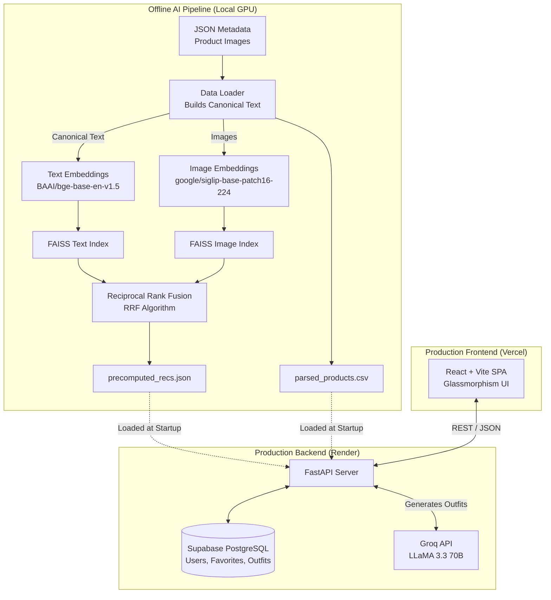

# FasRec – Full-Stack GenAI Fashion Engine

FasRec is a production-grade, AI-powered fashion recommendation and styling platform. It uses a state-of-the-art hybrid multimodal offline pipeline to find visually and semantically similar items, coupled with a dynamic LLaMA 3.3-70B integration that generates real-time, catalog-grounded outfit recommendations.


## 📊 Dataset
This engine is built on the [Fashion Product Images Dataset](https://www.kaggle.com/datasets/paramaggarwal/fashion-product-images-dataset). It utilizes both the rich JSON metadata files (for deep semantic text features like Fit, Occasion, and Descriptions) and the high-resolution product imagery.

---

## 🏗️ System Architecture



## ✨ Key Features

- **SOTA Multimodal Retrieval**: Generates text embeddings using `BAAI/bge-base-en-v1.5` (from rich canonical JSON text) and image embeddings using Google's `siglip-base-patch16-224`.
- **Reciprocal Rank Fusion (RRF)**: Replaces static score weights with rank-based mathematical fusion, perfectly balancing visual and semantic similarity (normalized for UI percentage matching).
- **GenAI Outfit Stylist**: Integrates Groq (LLaMA 3.3-70B) to act as a personal stylist. The LLM is grounded using actual database `articleTypes`, ensuring suggested outfit pieces perfectly match items available in the 44k catalog.
- **Smart Catalog Search**: Multi-strategy fallback search (Exact → Word-by-Word → Fuzzy) maps LLM text generations back to real database items.
- **User Persistence & Dashboards**: Full authentication system (bcrypt/JWT) with Supabase PostgreSQL to save favorite items and AI-generated outfits.
- **Monorepo Structure**: Clean separation of concerns with independent deployability to Render (Backend) and Vercel (Frontend).

## 🛠️ Technology Stack

- **Machine Learning**: PyTorch, HuggingFace Transformers, FAISS
- **Backend**: Python 3.11, FastAPI, SQLAlchemy, PostgreSQL (Supabase)
- **Frontend**: React 18, Vite, React Router, Custom CSS (Glassmorphism)
- **Generative AI**: Groq (LLaMA 3.3-70B-Versatile)
- **Deployment**: Render (API), Vercel (Web), Cloudflare R2 (Image CDN)

## 📁 Monorepo Structure

```text
FasRec/
├── backend/                  # FastAPI Application & AI Pipeline
│   ├── artifacts/            # Generated assets (precomputed_recs.json, FAISS indexes)
│   ├── data/                 # Raw dataset (styles/, images/)
│   ├── scripts/              # Offline AI processing scripts (01 to 03)
│   ├── src/                  # API, Auth, LLM Orchestration, DB Models
│   └── requirements.txt      # Slimmed deps for Render deployment
├── frontend/                 # React Web Application
│   ├── src/                  # React Components, Pages, AuthContext
│   ├── index.html            # Vite entry point
│   └── package.json          # Node dependencies
├── render.yaml               # Render deployment blueprint
└── vercel.json               # Vercel SPA routing rules
```

## 🚀 Setup & Execution

### 1. Offline AI Pipeline (Local)
To precompute the recommendations using your local GPU:
```bash
cd backend
pip install -r requirements_ml.txt # Install torch, transformers, faiss
python scripts/01_generate_embeddings.py
python scripts/02_build_faiss_index.py
python scripts/03_precompute_recommendations.py
```
*Note: This generates `precomputed_recs.json` and `parsed_products.csv` which are tracked in git for the production server.*

### 2. Backend Development Server
```bash
cd backend
pip install -r requirements.txt
uvicorn src.api:app --reload --host 0.0.0.0 --port 8000
```
*Requires `.env` with `DATABASE_URL` (Supabase), `GROQ_API_KEY`, and `JWT_SECRET_KEY`.*

### 3. Frontend Development Server
```bash
cd frontend
npm install
npm run dev
```

## 🌍 Production Deployment

1. **Backend**: Deployed to Render via the included `render.yaml` blueprint. It installs only the lightweight serving dependencies (no PyTorch/FAISS required) and loads the precomputed JSON artifacts into memory.
2. **Frontend**: Deployed to Vercel via the Vercel GitHub integration. Configured with `vercel.json` to support React Router SPA navigation. Ensure `VITE_API_URL` is set to the Render backend URL.
