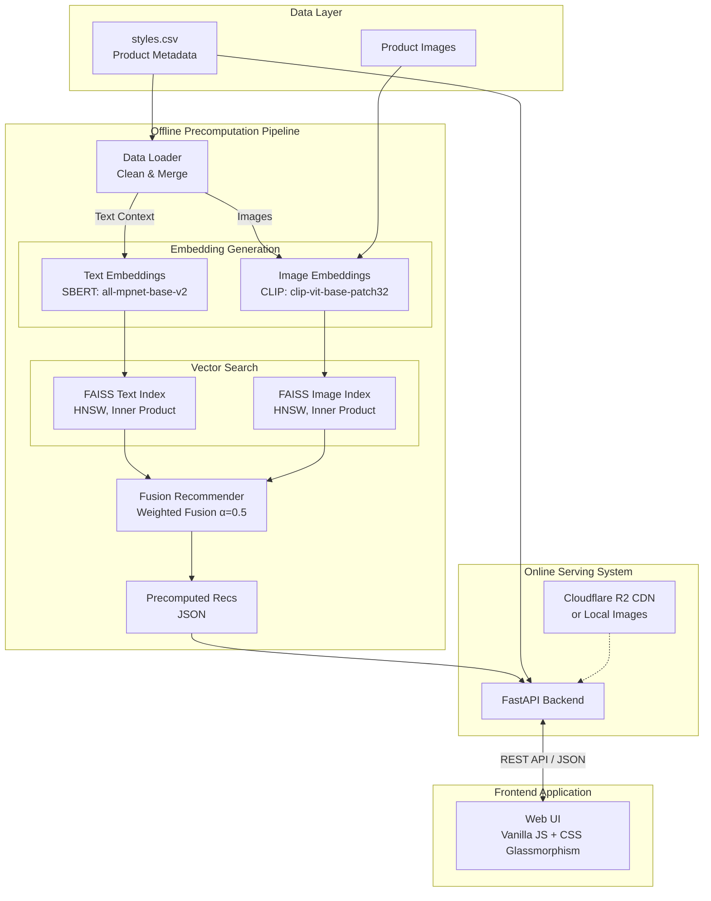

# FasRec – Fashion Recommendation Engine

FasRec is an end-to-end AI-powered fashion recommendation system. It utilizes a hybrid multimodal approach, generating embeddings for both product text descriptions and product images to provide highly accurate visually and semantically similar fashion item recommendations.

The system uses an offline pipeline to compute and cache recommendations and a high-performance FastAPI backend to serve the precomputed recommendations to a dynamic, modern frontend interface.

## 🏗️ End-to-End System Architecture



## ✨ Features

- **Multimodal AI Recommendations:** Combines semantic text similarity (Sentence Transformers/SBERT) and visual similarity (OpenAI CLIP) for robust results.
- **High-Performance Vector Search:** Utilizes FAISS HNSW indexes (GPU accelerated if available) for extremely fast neighbor retrieval.
- **FastAPI Backend:** A lightweight, async REST API that serves precomputed top-K recommendations for sub-millisecond response times.
- **Modern UI:** A beautiful, responsive glassmorphism web interface to browse products and view similar items.
- **CDN Integration:** Easily serves images from local storage or scalable Cloudflare R2 object storage.
- **Dockerized:** Fully containerized backend using `docker-compose` for rapid deployment.

## 🛠️ Technology Stack

- **Machine Learning / AI:** PyTorch, Sentence-Transformers (SBERT), Transformers (CLIP), FAISS (Facebook AI Similarity Search)
- **Data Processing:** Pandas, NumPy
- **Backend:** Python 3, FastAPI, Uvicorn
- **Frontend:** HTML5, Vanilla JavaScript, CSS3
- **Deployment:** Docker, Render, Cloudflare R2 (optional)

## 📁 Project Structure

```text
FasRec/
├── data/
│   ├── images/               # Raw product images
│   └── styles.csv            # Product metadata
├── artifacts/                # Generated assets
│   ├── text_index.faiss      # FAISS index for text
│   ├── image_index.faiss     # FAISS index for images
│   ├── product_ids.npy       # Mapping array
│   └── precomputed_recs.json # Top-K recommendations JSON
├── src/                      # Core Backend Modules
│   ├── api.py                # FastAPI Application
│   ├── data_loader.py        # Data preprocessing
│   ├── embeddings.py         # SBERT & CLIP embedding logic
│   ├── faiss_index.py        # Vector database management
│   └── recommender.py        # Fusion scoring logic
├── scripts/                  # Offline Pipeline Scripts
│   ├── 01_generate_embeddings.py
│   ├── 02_build_faiss_index.py
│   ├── 03_precompute_recommendations.py
│   ├── 04_evaluate.py
│   └── 05_upload_images_r2.py
├── frontend/                 # Web Application
│   └── index.html
├── requirements.txt          # Python dependencies
├── Dockerfile                # API container definition
└── docker-compose.yml        # Multi-container orchestration
```

## 🚀 Setup & Installation

### 1. Prerequisites
- Python 3.10+
- (Optional) CUDA-enabled GPU for faster embedding generation.

### 2. Install Dependencies
```bash
python -m venv venv
source venv/bin/activate  # On Windows: venv\Scripts\activate
pip install -r requirements.txt
```

### 3. Data Preparation
Place your dataset in the `data/` directory:
- `data/styles.csv`
- `data/images/12345.jpg`, etc.

### 4. Run the Offline Pipeline
Generate embeddings, build FAISS indexes, and precompute the recommendations.
```bash
python scripts/01_generate_embeddings.py
python scripts/02_build_faiss_index.py
python scripts/03_precompute_recommendations.py
```

### 5. Start the API Server
```bash
# Using uvicorn directly
uvicorn src.api:app --reload --host 0.0.0.0 --port 8000

# OR using Docker Compose
docker-compose up --build -d
```

### 6. Access the Application
- **Frontend UI**: [http://localhost:8000/app](http://localhost:8000/app)
- **API Documentation**: [http://localhost:8000/docs](http://localhost:8000/docs)

## 🔌 API Endpoints

- `GET /` - API Status and Version.
- `GET /products` - Paginated product listing with optional `search`, `category`, and `gender` filters.
- `GET /recommend/{item_id}` - Fetch top precomputed fusion recommendations for a specific product.
- `GET /similar/{item_id}` - Alternative endpoint returning scores alongside similar items.
- `GET /categories` - Retrieve available metadata filters (genders, master categories).

## 📊 Offline Evaluation

The project includes an evaluation script to measure the precision and recall of the recommendation engine using a holdout/synthetic testing strategy.
```bash
python scripts/04_evaluate.py
```
